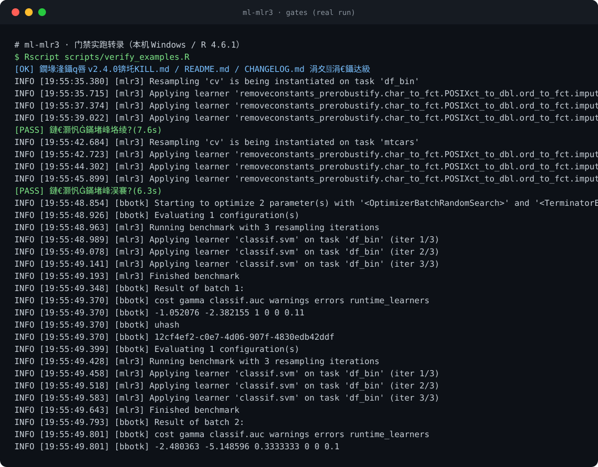

<sub>🌐 <a href="README.md">中文</a> · <b>English</b></sub>

# ml-mlr3 · an mlr3verse machine-learning modeling skill

> *"Anyone can write model code. The hard part is never quietly peeking at the test set."*

[](CHANGELOG.md)
[](SKILL.md)
[](https://github.com/zhjx19/ml-mlr3/actions/workflows/gates.yml)
[](#verification--testing)
[](examples/EXAMPLE.md)
[](#verification--testing)
[](https://github.com/zhjx19/ml-mlr3)
[](https://skills.sh/zhjx19/ml-mlr3)
[](LICENSE)

**It turns "mlr3 code that is easy to get wrong" into "a reproducible workflow that respects data splitting, leakage prevention, tuning and final evaluation from start to finish."**

**Evidence in 30 seconds**: two modeling prompts, each written twice — a "typical answer without the skill" and an "answer following this skill" — then scored with two rulers. The typical-answer side: **6 discipline violations, all FAIL** (`set.seed(42)`, slicing out the test set and hitting it during development, treating random CV as time-series resampling) **plus 8 keys that do not exist in the dictionary at all** (`po("imputehci")`, `rsmp("cs")`, `tsk("classif", formula=)`, `msr("classif.kappa")`, etc. — copy them and it breaks). The skill-following side: **9/9 assertions PASS, 0 hallucinated keys**. Raw answers, line-by-line output and re-run commands are in **[examples/EXAMPLE.md](examples/EXAMPLE.md)**.



<sub>Rendered from the real gate transcript (`assets/gates-output-2026-09-26.txt`) by `node scripts/render_evidence_card.mjs` — reproducible and diffable.</sub>

[Join the chat on problems](#what-problem-it-solves) · [What it delivers](#what-it-delivers) · [Quick start](#quick-start) · [Triggers](#triggers) · [Safety boundaries](#safety-boundaries) · [Verification & testing](#verification--testing) · [Version & changelog](#version--changelog)

---

## What problem it solves

Ask an agent to write mlr3 modeling code and it will probably run. But look closely: the test set was already `predict()`-ed; scaling and SMOTE were done by hand on the full data before modeling; after tuning it reports "generalization performance" from the same CV that tuned it; parallelism maxes out every core and eats your memory without checking the machine. Each line looks "fine" on its own; together they inflate the entire performance estimate. mlr3's R6 reference semantics (`$select()` mutates in place) and its graph-learner syntax (`%>>%` mixed up with `|>`) make LLMs trip especially easily.

This skill is not an API manual — it encodes that discipline as hard rules the agent must follow: five absolute red lines + a default workflow + on-demand references. With it installed, the modeling flow an agent writes is disciplined by default.

## What it delivers

- A complete, runnable R workflow: `partition()` split → PipeOp feature engineering → `benchmark()` to compare learners → `auto_tuner()` tuning → nested resampling for unbiased evaluation → a one-shot test-set evaluation after authorization.
- Two **minimal skeletons** (classification / regression), verified live; complex needs are routed to 10 reference files.
- Active interception of violating requests: hitting the test set directly, preprocessing outside the graph, maxing out parallelism without checking the machine.

## Quick start

**Prerequisites**: R (≥ 4.2 recommended) + `mlr3verse`; the evals scorer needs Node ≥ 18 (optional). Zero API keys, everything runs locally.

Two entry points only: **skills.sh** (one command) and **GitHub** (clone + symlink, works for any agent's skills directory). **Why no Claude Code plugin-marketplace channel**: it would require maintaining a second copy of version metadata parallel to `SKILL.md`, and this repo has already had one "two channels, two version numbers" incident; fewer entry points means fewer promises to keep (see CHANGELOG [2.4.0]).

Option 1: skills.sh

```bash
npx skills add zhjx19/ml-mlr3
```

Option 2: GitHub (ZCode / Claude Code / OpenCode — anything that reads a skills directory)

```bash
git clone https://github.com/zhjx19/ml-mlr3.git
ln -s "$(pwd)/ml-mlr3" <your-agent-skills-dir>/ml-mlr3
```

Then say to the agent:

```text
Use mlr3verse to build a classification modeling workflow for this data:
split the data, compare a few algorithms, then evaluate.
```

## Triggers

- "Help me build a predictive model with mlr3 / mlr3verse"
- "Compare a few algorithms with mlr3 — which is better?"
- "How do I tune hyperparameters in mlr3 / how do I write auto_tuner?"
- "Where does SMOTE go so it does not leak?"
- "How do I do nested resampling?"
- "How do I build a GraphLearner / PipeOp / graph learner?"
- "Do feature selection and tuning together"

## Safety boundaries

| Red line | Behavior |
|---|---|
| Test set stays sealed | During development, no predict / summary / plot / tuning on `split$test`; final evaluation **must ask the user first** and is run once after permission |
| R6 reference semantics | Deep-copy with `$clone(deep = TRUE)` before modifying a Task/Learner; never pollute the original |
| No data leakage | All preprocessing (imputation / encoding / scaling / PCA / SMOTE / feature selection) goes inside a PipeOp graph, fitted within resampling |
| Measure before parallelizing | Parallelism is on by default, but before `future::plan()` you must probe `availableCores()` + `ps_system_memory()` and size workers to the real load; when parallelizing over folds, `set_threads(learner, n = 1L)` |
| Nested resampling purpose | Unbiased comparison only; real tuning goes through `auto_tuner$train()` |

It will not do: deep learning, non-tabular data, tidymodels workflows (it points you to that ecosystem instead), or lightweight exploratory grouped modeling (one `dplyr` `nest` + `map` is enough — no mlr3 needed).

## How it differs from the tidymodels skill

Both serve the same modeling goal with different object models — **do not mix the syntax**:

| Dimension | tidymodels skill | this skill |
|---|---|---|
| Preprocessing | `recipe()` + `workflow()` | R6 `Task` + PipeOp graph + `ppl("robustify")` |
| Tuning | `tune_grid()` and the tune suite | `auto_tuner()` / `to_tune()`, branch-routing tuning |
| Feature selection | recipes + finetune | `auto_fselector()` / `po("filter")` joint tuning |
| User names mlr3verse | refers you here | executes this skill's flow directly |

## File structure

```text
ml-mlr3/
├── SKILL.md                   # entry: live API checks, rules, five red lines, default workflow, minimal skeletons
├── evals.json                 # 6 eval prompts + machine-checkable assertions (mirrors tidymodels' official evals shape)
├── references/
│   ├── data-spending.md       # data splitting & test-set isolation
│   ├── resampling.md          # CV / repeated CV / holdout / grouped / time-series custom rolling folds
│   ├── feature-engineering.md + feature-engineering/  # PipeOp preprocessing overview + 4 deep dives
│   ├── tuning.md              # auto_tuner / auto_fselector
│   ├── evaluation.md          # metrics, ROC/PRC/residual plots, benchmark, final evaluation
│   └── advanced-workflows.md  # 5 advanced workflows (tuning benchmark / graph tuning / imbalance / joint tuning / early stopping)
├── scripts/
│   ├── verify_examples.R      # skeleton regression: 20 cases run live (with dictionary probes)
│   ├── list_example_deps.R    # derive required R packages from the examples (CI no longer hand-copies the list)
│   ├── check_answer_api.R     # hallucinated-key audit: flag lrn()/po()/msr()/rsmp()/tnr()/tsk()/ppl() keys not in the dictionary
│   └── run_evals.mjs          # evals assertion scorer (zero-dependency Node)
├── examples/
│   ├── EXAMPLE.md             # evidence: baseline-vs-skilled replay + raw output of both rulers + re-run commands
│   └── replay/                # four real answers (baseline-* / skilled-*) consumed directly by the two scorers
└── evals/outputs/             # where eval answers live (eval-<id>.md)
```

## Verification & testing

**Skeleton regression** (must be re-run after touching SKILL.md examples):

```bash
Rscript scripts/verify_examples.R
```

Most recent real run:

```text
[OK] version self-consistent v2.4.0 (SKILL.md / README.md / CHANGELOG.md)
[PASS] minimal skeleton · classification
[PASS] minimal skeleton · regression
[PASS] auto_tuner (svm conditional params)
[PASS] ppl(branch) branch tuning
[PASS] time series · custom rolling folds
[PASS] benchmark after tuning
[PASS] early stopping · best_valid_score
[PASS] selector · integer columns & symbolic selectors
[PASS] greplicate + materialize
[PASS] datefeatures calendar expansion
[PASS] Task · accessor semantics
[PASS] tuning archive · dtype & trafo scale
[PASS] learner$deadline
[PASS] dictionary probe · documented objects
[PASS] PipeOp type preconditions · splines/boxcox/subsample/select
[PASS] selector · integer & affected_cols semantics
[PASS] doc signatures · graph tuning & lts preset spaces
[PASS] resampling pitfalls · bootstrap/encapsulation fallback/strata/threads
[PASS] doc wording · spatialsign ownership / deps / validate='test' silence
[PASS] doc wording · robustify graph accessors / param ids / default overrides

=== summary: 20/20 PASS ===
```

**CI gates ≠ a free pass.** CI runs the same three gates as local; the dependency list is not hand-copied — `scripts/list_example_deps.R` derives it from the examples themselves ("scanning the dictionary" misses the dictionary's own provider package — `classif.lightgbm`'s registering package is the live example; details in CHANGELOG):

```bash
Rscript scripts/list_example_deps.R                       # what packages the examples need; what is missing locally
Rscript scripts/list_example_deps.R --print-list          # print package names only
Rscript scripts/list_example_deps.R --install             # the exact command CI uses
Rscript scripts/list_example_deps.R --mirror --repos <your CRAN mirror>   # preflight: does CI's snapshot have it?
```

`.github/workflows/gates.yml` does three things per push / PR: install dependencies from that list → run all 20 cases (ubuntu + windows; no trimming cases, folds or budget) → run a hallucinated-key audit over every documented example; another job runs the assertion-engine selftest. **A red light carries its own diagnosis**: on failure the `FAIL:` / `[hallucinated]` lines and the per-package load receipts from the install step are emitted as workflow annotations, not just a status light. **Environment & packages**: the gate declares and installs **system-level prerequisites** in the workflow (ubuntu's missing `libglpk.so.40` via `apt-get install libglpk40`) — provisioning the test environment in the open, not papering over an assertion. Beyond system prerequisites the gate only diagnoses: it never loosens assertions or trims the list. Missing `libglpk.so.40` used to make ubuntu's `igraph` binary fail to `dlopen`, so `classif.kknn` failed to load and the case `ppl(branch) branch tuning` could not execute (that was the real impact of the red ubuntu light); with the prerequisite installed, ubuntu should be as green as windows — this change is awaiting CI verification on the next push, and is not claimed green in advance. Windows and local are green.

The diagnostic scripts have their own regression: `Rscript scripts/test_install_logged.R scripts/list_example_deps.R` (ten assertion sections, **requires network** — it really installs a small package into a temp library, and can take minutes on a restricted network); `--install-probe <pkg>` reproduces the clean-machine install path in a local temp library and never touches your user library.

**After changing example code you still must run it locally**, and record the pass rate in the CHANGELOG — CI only proves "these two platforms, this point-in-time CRAN snapshot" work; the environment you ship to users is your own machine, and the two records cannot substitute for each other.

**Evals** (the 6 prompts in evals.json cover the standard flow / red-line interception / time series / imbalance / regression / nested-resampling trap): store answers in `evals/outputs/eval-<id>.md`, then:

```bash
node scripts/run_evals.mjs --selftest   # engine selftest (golden 0 FAIL, violations 5/5, unclosed fence 5/5)
node scripts/run_evals.mjs              # score every assertion; any FAIL exits 1
```

2026-09-26 two-way replay (developer self-test):

- **A group** (answers following this skill's discipline ×6): all 26 assertions PASS — everything the skill teaches passes the red-line audit.
- **B group** (typical errors without the skill ×6, in `evals/outputs/negative/`): all 12 FAILs caught — common seeds, hitting the test set during development, out-of-graph SMOTE, random CV on time series, maxing parallelism without checking resources, confusing what nested resampling is for.

**Hallucinated-key audit** (the second ruler for the assertion engine). Assertions check discipline only, not "the code looks fine but `po("imputehci")` does not exist":

```bash
Rscript scripts/check_answer_api.R examples/replay/skilled-eval-1.md examples/replay/baseline-eval-1.md
```

It probes every first argument of `lrn()/po()/msr()/rsmp()/tnr()/tsk()/ppl()` in an answer against the mlr3verse dictionaries, names non-existent keys and appends the dictionary's own "Did you mean" hint, and exits 1. Locally: all 4+4 hallucinated keys in the `baseline-*` pair were caught; feeding `SKILL.md` + all `references/` + the 6 A-group answers + `examples/replay/skilled-*` gives **168 unique keys, 0 hallucinated** (this number changes as the prose changes — trust a fresh run). CI runs this same audit on every push — if the code the skill teaches ever rots because upstream renamed something, the gate goes red before a user complains.

## Version & changelog

**Current released version: v2.4.0** (CHANGELOG and the `SKILL.md` frontmatter are synced to 2.4.0; the latest online tag is still `v2.3.0`, as `v2.4.0` awaits an explicit authorization to tag). This repo's own version and history are part of the product and travel with it:

| Where | What |
|---|---|
| [`CHANGELOG.md`](CHANGELOG.md) | version-by-version, each explaining **why** it changed, not just what; unreleased work accumulates under `[Unreleased]` |
| [tags](https://github.com/zhjx19/ml-mlr3/tags) | tagging = releasing: `v2.3.0` ← `v2.2.0` ← `v2.1.0`; the hero `version` badge reads the latest tag, so it still shows `v2.3.0` right now |
| `version:` in `SKILL.md` frontmatter | the copy that runtimes / marketplaces read |

**All three must be byte-identical, and a machine checks it**: the top of `scripts/verify_examples.R` has a self-check (not counted as a case) comparing the SKILL.md frontmatter / this README section / the newest **released** CHANGELOG entry, and goes red on any mismatch. Why it is worth a ruler: this repo really did have two parallel version metadata copies (a marketplace declaration disagreeing with SKILL.md); that file is archived and removed, but "a version number copied in two places will drift apart" is a structural risk, not a coincidence.

Release discipline: changes accumulated under `[Unreleased]` are only tagged after explicit user authorization; before tagging, all gates must be green and any example change must have a **local run** record (not just green CI). As for the mlr3 usage the skill teaches, the prose deliberately **does not carry upstream package version numbers or migration notes** — that is mlr3's own NEWS's job; this skill keeps only one live-recorded environment line (see SKILL.md "live API checks") and the discipline of probing on the spot.

## Acknowledgements

- [tidymodels/skills](https://github.com/tidymodels/skills) — its evals/assertion shape and "discipline first" methodology are this skill's benchmark.
- [mlr3book](https://mlr3book.mlr-org.com) and [mlr3gallery](https://mlr3gallery.mlr-org.com) — authoritative mlr3verse documentation.
- [krishi-shah/ml-engineer-skills](https://github.com/krishi-shah/ml-engineer-skills) — the "ML mistake checker" idea.
- The upstream NEWS of mlr3 / mlr3pipelines / mlr3tuning / mlr3fselect is a source of leads for new usage; the skill prose keeps only currently **verified** usage, with no version accounts.

## License

[Apache License 2.0](LICENSE)

---

*The mlr3 ecosystem moves fast: before copying any example, probe whether the object exists via SKILL.md "live API checks"; the dictionary probes in `scripts/verify_examples.R` fail outright on a key that does not exist.*
